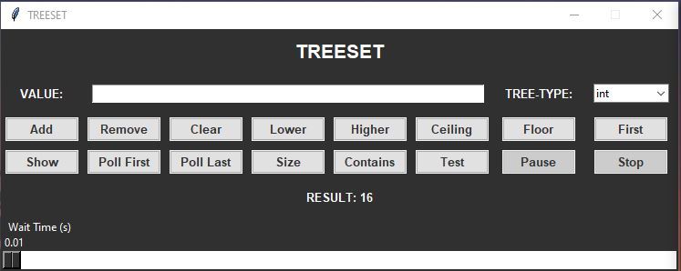
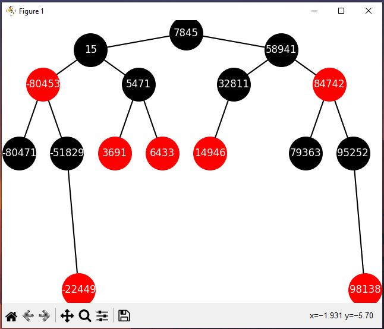

# TreeSet and RedBlackTree objects (tree_set, data_utils and tree_gui modules package)


This is a project developed in Python as part of Data Structures and Programming subject belonging to the Computer Science degree
of the U.L.P.G.C. University, in which you can gain access and use two main classes, a TreeSet and a Red-Black Tree.

## TreeSet

A TreeSet is a data structure that stores elements in a sorted order. It is implemented using a Red-Black Tree. The main
advantage of a TreeSet is that it allows to perform operations like add, remove and contains in O(log n) time complexity
while maintaining the elements in a sorted order.

### Example

```python
from tree_set import TreeSet

# Create a TreeSet
my_set = TreeSet(int)

# Add elements to the TreeSet
print(my_set.add(5)) # Will print True
print(my_set.add(3)) # Will print True
print(my_set.add(7)) # Will print True
print(my_set.add(1)) # Will print True

# Adding elements with wrong value type
try:
    my_set.add("Hello")
except TypeError as e:
    print(e)  # Will print "The element must be of type int"

# Check if an element is in the TreeSet
print(my_set.contains(3))  # Will print True

# Remove an element from the TreeSet
print(my_set.remove(3)) # Will print True

# Get the first element in the TreeSet
print(my_set.first())  # Will print 1

# Get the last element in the TreeSet
print(my_set.last())  # Will print 7

# Get the size of the TreeSet
print(my_set.size())  # Will print 3

# Get the elements in the TreeSet
print(my_set)  # Will print [1, 5, 7]

# Get the elements in the TreeSet in descending order
print([element for element in my_set.descending_iterator()])

# Clear the TreeSet
my_set.clear()

# Get the size of the TreeSet
print(my_set.size())  # Will print 0

# Check if the TreeSet is empty
print(my_set.is_empty())  # Will print True
```

## RedBlackTree

A Red-Black Tree is a binary search tree that is self-balancing. It is used to maintain a sorted collection of elements
while keeping the height of the tree logarithmic. The Red-Black Tree is a data structure that is used to implement the
TreeSet class.

### Example

```python
from data_utils import RedBlackTree

# Create a Red-Black Tree
my_tree = RedBlackTree()

# Insert elements into the Red-Black Tree
print(my_tree.add(5))  # Will print True
print(my_tree.add(3))  # Will print True
print(my_tree.add(7))  # Will print True
print(my_tree.add(1))  # Will print True

# Insert elements with wrong value type
print(my_tree) # Will print [1, 3, 5, 7]
```

## data_utils module

In this module you can find the RedBlackTree class, and also some other minor data structures like the Node class, the TreeNode
class, the SimpleQueue class and the SimpleStack class. All of these classes are used to implement the main to data structures
presented in this project. They can also be used independently.

## tree_gui module




This module contains a GUI application that allows you to interact with the TreeSet class. The GUI application allows you to
add, remove and search for elements in the TreeSet. It also allows you to clear the TreeSet and to get the first and last
elements in the TreeSet in a graphical way.

## Documentation

To see full documentation of both classes visit the [Official Documentation Website](https://javier-castilla.github.io/TreeSet-in-Python/)

## Authors

Developed by:
- Javier Castilla
- Saúl Expósito
- Jesús David García
- Náyade García
